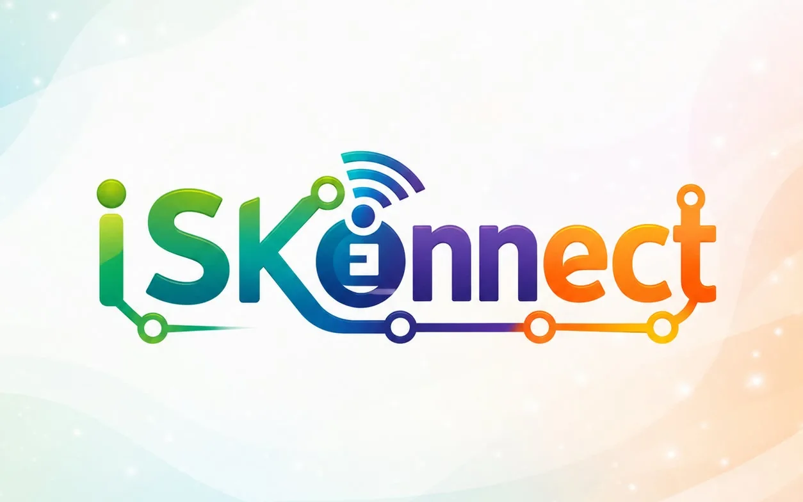
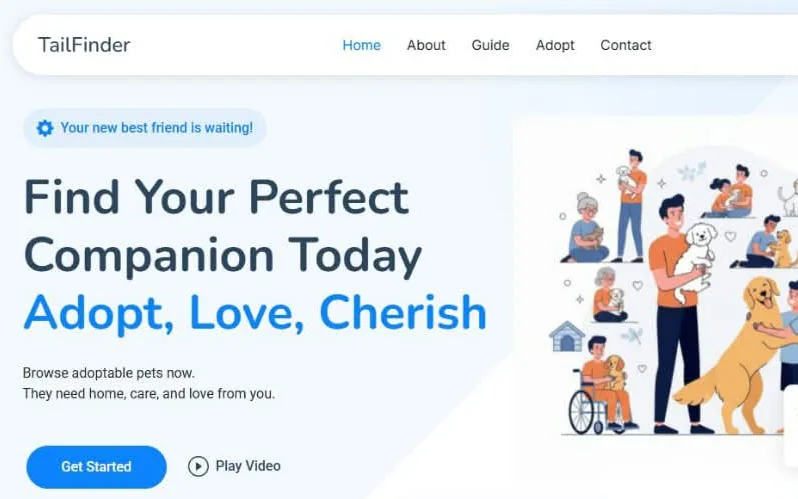
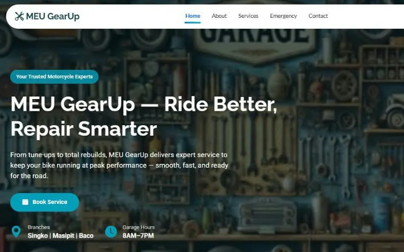
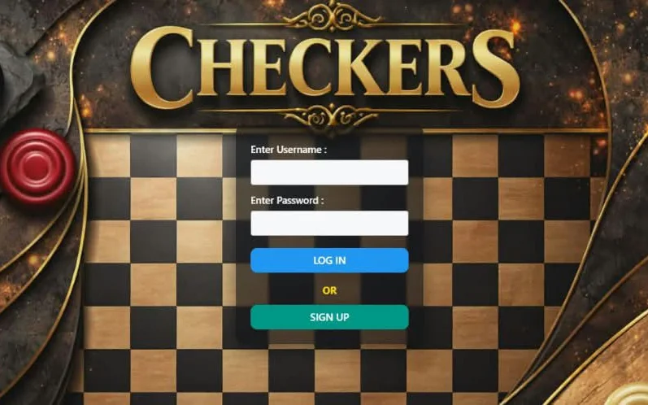
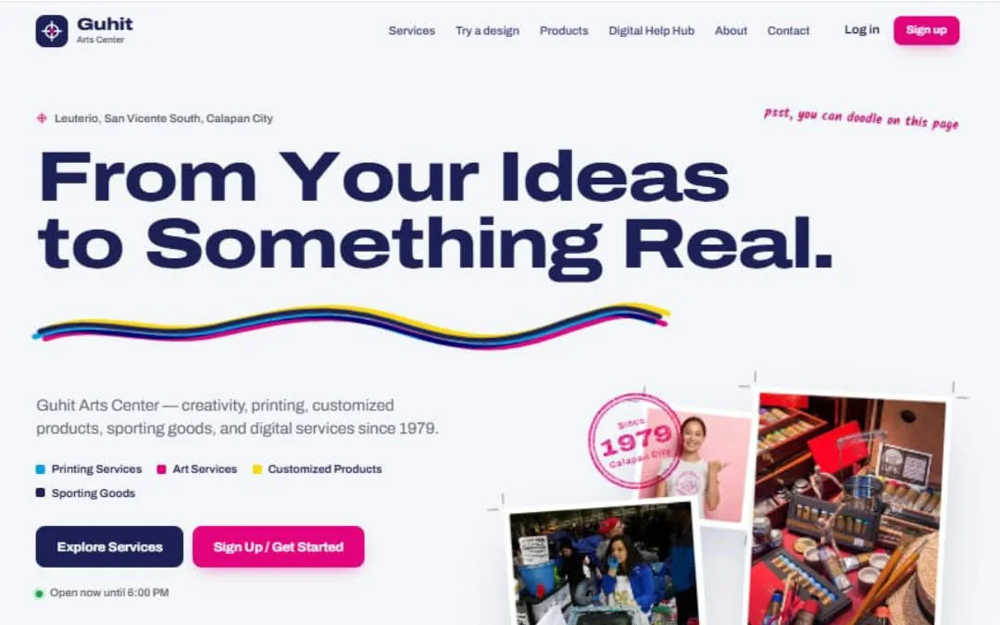

<picture>
  <source media="(prefers-color-scheme: dark)" srcset="assets/header-dark.svg">
  
</picture>

<p align="center">
  <a href="https://fredanthonyyy.vercel.app"></a>
  <a href="https://fredanthonyyy.vercel.app/#contact"></a>
  
</p>

## Hi, I'm Fred 👋

I'm a 4th-year **BS Information Systems** student at **City College of Calapan** who enjoys turning ideas into working applications. I work across web, mobile, and backend development, and I learn best by building real projects — software that isn't just functional, but actually useful to the people who use it.

```js
const fred = {
  studying:   "BS Information Systems @ City College of Calapan (4th year)",
  building:   "ISKONNECT — a scholarship management system (capstone)",
  lookingFor: "Internship / OJT in web, mobile, or full-stack development",
  certified:  ["Java Programming NC III", "Computer System Servicing NC II", "Microsoft Cyber Security Course"],
};
```

## Tech stack

**Main development**<br>
<picture>
  <source media="(prefers-color-scheme: dark)" srcset="https://skillicons.dev/icons?i=flutter,react,nodejs,nestjs,php,ts,js,html,css,bootstrap&theme=dark">
  
</picture>

**Backend & data** &nbsp;·&nbsp; **Also code in**<br>
<picture>
  <source media="(prefers-color-scheme: dark)" srcset="https://skillicons.dev/icons?i=postgres,mysql,firebase,supabase,python,java,cpp&theme=dark">
  
</picture>

**Tools**<br>
<picture>
  <source media="(prefers-color-scheme: dark)" srcset="https://skillicons.dev/icons?i=git,github,vscode,androidstudio,visualstudio,figma&theme=dark">
  
</picture>

## Featured projects

<table>
  <tr>
    <td width="50%" valign="middle">
      <a href="https://iskonnect-scholar.web.app"></a>
    </td>
    <td width="50%" valign="middle">
      <h3>ISKONNECT <sub><sup>· capstone</sup></sub></h3>
      A mobile-based scholarship management system for applicants, scholars, requirements, academic records, attendance, announcements, and scholarship monitoring.
      <br><sub><b>Flutter · React.js · NestJS · PostgreSQL · Prisma</b></sub>
      <br><a href="https://iskonnect-scholar.web.app">Live app ↗</a> &nbsp;·&nbsp; <sub>source is private</sub>
    </td>
  </tr>
  <tr>
    <td width="50%" valign="top">
      <a href="https://tailfinder-mu.vercel.app"></a>
      <h3>TailFinder</h3>
      A pet adoption system connecting adopters with available pets, with management tools for administrators.
      <br><sub><b>PHP · CodeIgniter · MySQL</b></sub>
      <br><a href="https://tailfinder-mu.vercel.app">Live demo ↗</a> &nbsp;·&nbsp; <a href="https://github.com/heyitsmefarid/tailfinder">Code</a>
    </td>
    <td width="50%" valign="top">
      <a href="https://meugearup.vercel.app"></a>
      <h3>MEU Gear Up</h3>
      A multi-branch motorcycle shop system with portals for customers, mechanics, suppliers, and admins — service booking, roadside assistance, POS, stock transfers, and sales reports.
      <br><sub><b>PHP · MySQL · Bootstrap · Chart.js · PHPMailer</b></sub>
      <br><a href="https://meugearup.vercel.app">Live demo ↗</a> &nbsp;·&nbsp; <a href="https://github.com/heyitsmefarid/meu_gearup">Code</a>
    </td>
  </tr>
  <tr>
    <td width="50%" valign="top">
      <a href="https://checkers-theta-lemon.vercel.app"></a>
      <h3>Checkers Game</h3>
      Checkers with player accounts, a two-player mode, and a computer opponent — on Hard it looks five moves ahead using minimax with alpha-beta pruning.
      <br><sub><b>C# · .NET 8 WinForms · MySQL</b></sub>
      <br><a href="https://checkers-theta-lemon.vercel.app">Play the web version ↗</a> &nbsp;·&nbsp; <a href="https://github.com/heyitsmefarid/checkers">Code</a>
    </td>
    <td width="50%" valign="top">
      <a href="https://guhit-arts.vercel.app"></a>
      <h3>Guhit Arts Center</h3>
      A front-end prototype for an arts &amp; printing shop: preview your own text on a mug or shirt, shop with order tracking, and an admin panel with sales reports.
      <br><sub><b>React · Vite · React Router</b></sub>
      <br><a href="https://guhit-arts.vercel.app">Live demo ↗</a> &nbsp;·&nbsp; <a href="https://github.com/heyitsmefarid/guhit-arts">Code</a>
    </td>
  </tr>
</table>

## Contributions

<picture>
  <source media="(prefers-color-scheme: dark)" srcset="https://raw.githubusercontent.com/heyitsmefarid/heyitsmefarid/output/snake-dark.svg">
  
</picture>

## Let's connect

Looking for an intern who learns by building? I'd love to hear from you — see more of my work and reach me through my **[portfolio ↗](https://fredanthonyyy.vercel.app)**.
