<a href="https://fredanthonyyy.vercel.app">
  <picture>
    <source media="(prefers-color-scheme: dark)" srcset="assets/header-dark.svg">
    
  </picture>
</a>

  
  
  

## `01` &nbsp;whoami

Hi, I'm Fred 👋 — I enjoy turning ideas into working applications. I work across web, mobile, and backend development, and I learn best by building real projects: software that isn't just functional, but actually useful to the people who use it.

<picture>
  <source media="(prefers-color-scheme: dark)" srcset="assets/neofetch-dark.svg">
  
</picture>

## `02` &nbsp;stack

`~/stack/main` 
<picture>
  <source media="(prefers-color-scheme: dark)" srcset="https://skillicons.dev/icons?i=flutter,react,nodejs,nestjs,php,ts,js,html,css,bootstrap&theme=dark">
  
</picture>

`~/stack/data` &nbsp; `~/stack/also` 
<picture>
  <source media="(prefers-color-scheme: dark)" srcset="https://skillicons.dev/icons?i=postgres,mysql,firebase,supabase,python,java,cpp&theme=dark">
  
</picture>

`~/stack/tools` 
<picture>
  <source media="(prefers-color-scheme: dark)" srcset="https://skillicons.dev/icons?i=git,github,vscode,androidstudio,visualstudio,figma&theme=dark">
  
</picture>

## `03` &nbsp;projects

  <a href="https://iskonnect-scholar.web.app"><picture><source media="(prefers-color-scheme: dark)" srcset="assets/cards/iskonnect-dark.svg"></picture></a>
  <a href="https://tailfinder-mu.vercel.app"><picture><source media="(prefers-color-scheme: dark)" srcset="assets/cards/tailfinder-dark.svg"></picture></a>
  <a href="https://meugearup.vercel.app"><picture><source media="(prefers-color-scheme: dark)" srcset="assets/cards/meu-gear-up-dark.svg"></picture></a>
  <a href="https://checkers-theta-lemon.vercel.app"><picture><source media="(prefers-color-scheme: dark)" srcset="assets/cards/checkers-dark.svg"></picture></a>
  <a href="https://guhit-arts.vercel.app"><picture><source media="(prefers-color-scheme: dark)" srcset="assets/cards/guhit-arts-dark.svg"></picture></a>
  <a href="https://fredanthonyyy.vercel.app"><picture><source media="(prefers-color-scheme: dark)" srcset="assets/cards/more-dark.svg"></picture></a>

Click a card to open it live &nbsp;·&nbsp; source: <a href="https://github.com/heyitsmefarid/tailfinder">tailfinder</a> · <a href="https://github.com/heyitsmefarid/meu_gearup">meu_gearup</a> · <a href="https://github.com/heyitsmefarid/checkers">checkers</a> · <a href="https://github.com/heyitsmefarid/guhit-arts">guhit-arts</a> &nbsp;·&nbsp; ISKONNECT's source is private

## `04` &nbsp;activity

<picture>
  <source media="(prefers-color-scheme: dark)" srcset="https://raw.githubusercontent.com/heyitsmefarid/heyitsmefarid/output/snake-dark.svg">
  
</picture>

<a href="https://fredanthonyyy.vercel.app">
  <picture>
    <source media="(prefers-color-scheme: dark)" srcset="assets/footer-dark.svg">
    
  </picture>
</a>
